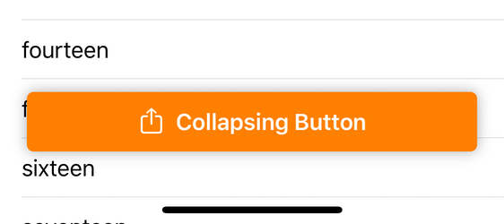
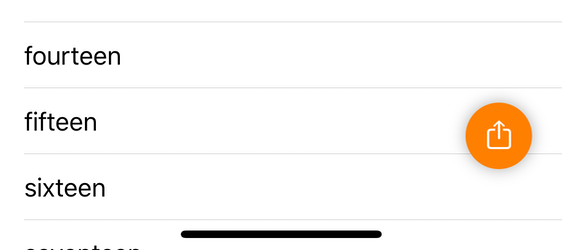

# CollapsingButton

This microframework provides a floating, collapsable button:





The button is intended to float over a scrollable view. It has the ability to automatically collapse and expand when the scrollable view is scrolled.

## Usage

The `CollapsingButton` class extends `UIControl` and can be used much like other controls. In the code snippet below, the button is added to a `UITableViewController` subclass.

```swift
class TableViewController: UITableViewController {

    private var collapsingButton: CollapsingButton!

    override func viewDidLoad() {
        super.viewDidLoad()

        collapsingButton = CollapsingButton(addedTo: tableView)
        collapsingButton.backgroundColor = .orange
        collapsingButton.foregroundColor = .white
        collapsingButton.label.text = "Collapsing Button"
        collapsingButton.imageView.image = UIImage(systemName: "square.and.arrow.up")
        collapsingButton.addTarget(self, action: #selector(toggleCollapsingButton(_:)), for: .touchUpInside)
    }
```

The `CollapsingButton` class implements the `UIScrollViewDelegate` protocol. If you set it as the delegate of a `UIScrollView`, it will automatically collapse when the user scrolls down (swipes up) and expand when the user scrolls up (swipes down).

When using `CollapsingButton` with a `UITableView`, you cannot set it as the scroll view delegate. Instead, you have to add the following two methods to your `UITableViewController`, forwarding the call to the button instance:

```swift
    override func scrollViewWillEndDragging(_ scrollView: UIScrollView, withVelocity velocity: CGPoint, targetContentOffset: UnsafeMutablePointer<CGPoint>) {
        collapsingButton.scrollViewWillEndDragging(scrollView, withVelocity: velocity, targetContentOffset: targetContentOffset)
    }

    override func scrollViewDidScrollToTop(_ scrollView: UIScrollView) {
        collapsingButton.scrollViewDidScrollToTop(scrollView)
    }
```


## Installation Instructions

Add the following to the dependencies in your `Package.swift` file:

```swift
.package(url: "https://github.com/RocketLaunchpad/CollapsingButton.git" from: "1.0.0")
```

